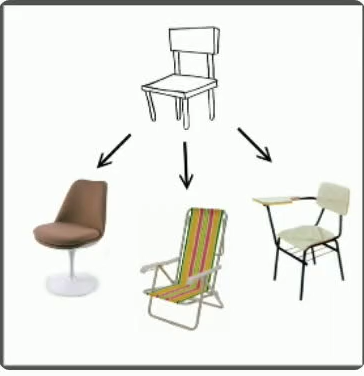

# Módulo 5 - Dart POO( Programação Orientada a Objeto)

## Fundamentos

---

**Abstração**:

- Assim como no nosso cotidiano nos abstraímos de certas dificuldades para atingirmos nossas metas, na programação orientada a objetos não poderia ser diferente. Afinal, programamos para automatizar processos do nosso dia a dia.

- **Abstração quer dizer**: "Processo pelo qual se isolam características, considerando os que tenham em comum certos grupos de objetos"

- A ideia que essa definição transmite é que não devemos nos preocupar com características menos importantes, ou seja, acidentais. Devemos, neste caso nos concentrar apenas nos aspectos essencias.

- Não existe pior prática em programação do que a repetição de código. Isto leva a um código frágil, propício a resultados inesperados. Quanto mais código são repetidos pela aplicação, mais difícil vai se tornando sua manutenção. Isso porque facilmente se pode esquecer de atualizar algum ponto que logo levará a uma inconsistência.

---

**Encapsulamento**:

- complexo:

  Uma analogia, com o mundo real. Quando alguém se consulta com um médico, por estar com um resfriado, seria desesperador se ao final da consulta o médico entregasse a seguinte receita:

- simples:

  Mais simples do que isso é o que os médicos realmente fazem: passam uma cápsula onde todas estas substáncias já estão prontas. Ou seja, elas já vêm **encapsuladas**.

  Com isso, não será preciso se preocupar em saber quanto e como as substâncias devem ser manupuladas para no final termos o comprimido que resolverá o problema.

  O que interessa é o resultado final, no caso, a cura do resfriado. A complexidade de chegar a essas medidas e como misturá-las não interessa. É um processo que não precisa ser do conhecimento do paciente.

- Essa mesma ideia se aplaca na Orientação a Objetos. No caso, a complexidade que desejamos esconder é a de implementação de alguma necessidade. Com o encapsulamento, podemos esconder a forma como algo foi feito, dando a quem precisa apenas o resultado gerado.

- Uma vantagem é que as mudanças se tornam transparente, ou seja, quem usa algum processamento não será afetado quando seu comportamento interno mudar

- Uma outra característica do encapsulamento é também a ocultação da informação.
  - ou seja ele não precisa saber como ta fazendo, mas que existe aquela função que faz algo.

## Classes

- Representação do mundo real.
- Aluno, paciente, Produto, etc
- Coisas do mundo real
- atributes e comportamentos
- o corpo do construtor é chamado dps de ja ter instanciado a classe

- late - sera iniciado dps
  - tomar cuidade com o late e o ! (Force non null)

## Herança

- heranca covariant: Pode alterar o tipo da variavel, se a classe for filho da classe pai declarada no metodo.

## Associação (Composição e Agregação)

## Polimorfismo

- Alterar a caracteristica de uma classe.

## Interfaces

## Auto Promoção de Tipos

## Mixins

É uma classe assim como qualquer outra, foi criado para suprir herança multipla.

Segue algumas caracteristicas:
1. para definir o mixin existe duas formas:
- com o `on`: define qual o tipo da classe deve ser para utilizar o mixin ou seja onde pode ser usado.
- sem o `on`: qualquer classe

2. para declarar um mixin existe duas formas:
- com abstract e não deve extender outras classes
`abstract class Teste{}`
- sem abstract
`mixin Teste{}`

3. não é possivel exterder um mixin
4. Se existir algum metodo com a mesma assinatura, irá sobrescrever ela, quem estiver por ultimo, ex:
`class Teste extends Artista with Dancar, Cantar`, a classe cantar ira sobrescrever metodos com a mesma assinatura.

## Cascade Notation

## Callable Class

Chama automaticamente metodos com nome call.
`String call(String teste){}`

## Operator Methods

No dart todos os operados são implementados.

## Assignment operators

## Equals, Hashcode e ToString

Sempre que sobscrever o == (*Equals*), todos os campos que envolver a igualdade, deve sobscrever o hashcode, porque existe algumas coleções que utiliza o hashcode para comparações.

## Ordenação default (Comparable)

## Asserts

por default o `asserts` esta desabilitado no dart, mas é possivel executar com a opção para habilitar.

`dart --enable-asserts .\1_asserts.dart`

## Modificador Const (Construtor)

Quando utiliza se o `const`, o dart valida se existe as mesmas configurações de outra instancia com `const` e aponta para a mesma referencia de memoria.

## Extensions

Capacidade que eu tenho de adicionar função dentro da classe que não tenho o código fonte.

## Metadatas (Annotations)

@ Anotações

- Para utilizar uma classe como uma `annotations`, o construtor deve ser um `const`
- 

## Getters e Setters

- encapsulamento de atributos.
- quando não tem regras de pegar ou atualizar os dados não faz sentido ter get e/ou set.
- caso haja regras de negocio para atribuir, basta utilizar essas nomenclaturas (get e set) que o resto do código continua funcionando normalmente.
  - no java por exemplo, utilizamos a nomenclatura setNome ou getNome, essas definições no dart quebra as atribuições do tipo `nome = 'teste'`

## Constructors Tear-off

- passar funções como parâmetro

## Tipos genericos

- passar tipo para uma classe