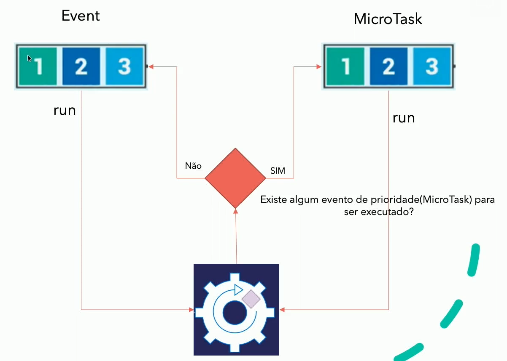
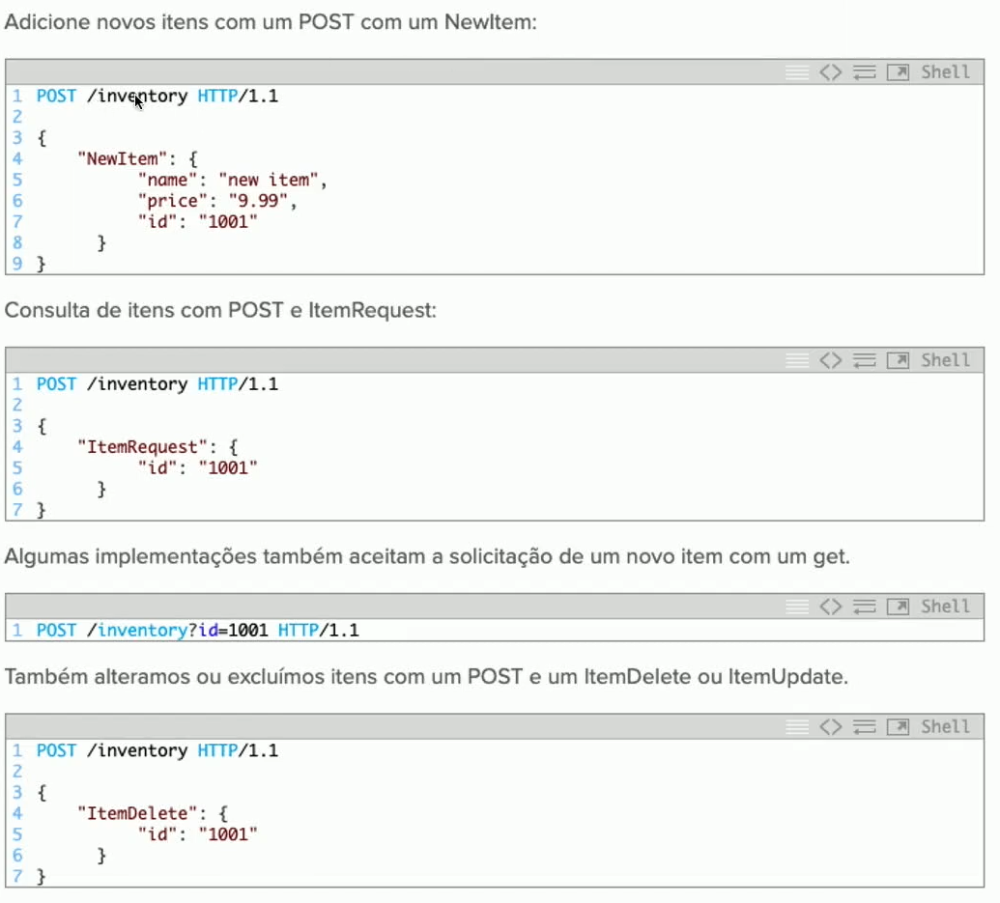

# Módulo 6 - Dart Async

## Async (Assincronismo)
---
## Futures
---
## Async Await
---
## Future.forEach e Future.wait

---
## Event Loop na VM Dart

### Event Loop - O que é?
- É um padrão de projeto que espera despachar eventos ou mensagens em um programa.
- Em Resumo ele é responsável por executar todos os processo dentro do sistema em uma determinada ordem.
### Event Loop - Como funciona?
- Event loop funciona com o conceito de Filas onde dentro dele existem 2 tipos de filas;
  - Filas de Event
  - Filas de MicroTask

### Filas de Event
- São sempre FIFO (First in First Out).
- Será sempre uma execução assíncrona.
- Tem Baixa prioridade de execução (Se comparado as microTask)
- Deve executar os processo pesados (Leitura, Http, Banco de dados, etc)

### Filas de MicroTasks
- São sempre FIFO (First in First Out).
- Será sempre uma execução síncrona.
- Tem Alta prioridade.
- Deve ser uma execução Rápida.

### Como funciona =>

---

## Rest e RestFul

- É uma troca de informações entre sistemas utilizando o protocolo Http.
- Em Resumo é um padrão de envio de dados utilizando a internet.

### Características (Cliente-servidor)
- Os aplicativos REST têm um servidor que gerencia os dados e o estado do aplicativo. O servidor se comunica com um cliente que lida com as interações do usuário. Uma separação clara de interesses divide os dois componentes. Isso significa que você pode atualizá-los e aprimorá-los de forma independente.
### Características (Stateles)
- Os servidores não mantêm nenhum estado de cliente. Os Clientes gerenciam o estado do aplicativo. Seus pedidos aos servidores contêm todas as informações necessárias para processá-los.

### O que não é
- A troca de documento entre servidores por meio do protocolo http não necessariamente é um serviço Rest ex:

- Este não é REST. Não estamos trocando os estado dos recursos.
- Estamos chamando uma função com argumentos que estão em um documento JSON ou argumentos de URL.
- Um serviço RESTful possui um URI para cada iem no inventário.

Exemplo de um Serviço RestFul.

---

## Adicionando códigos de terceiro ao nosso projeto

[Packages](https://pub.dev)
- http

## Trabalhando com Http
## Trabalhando com modelos