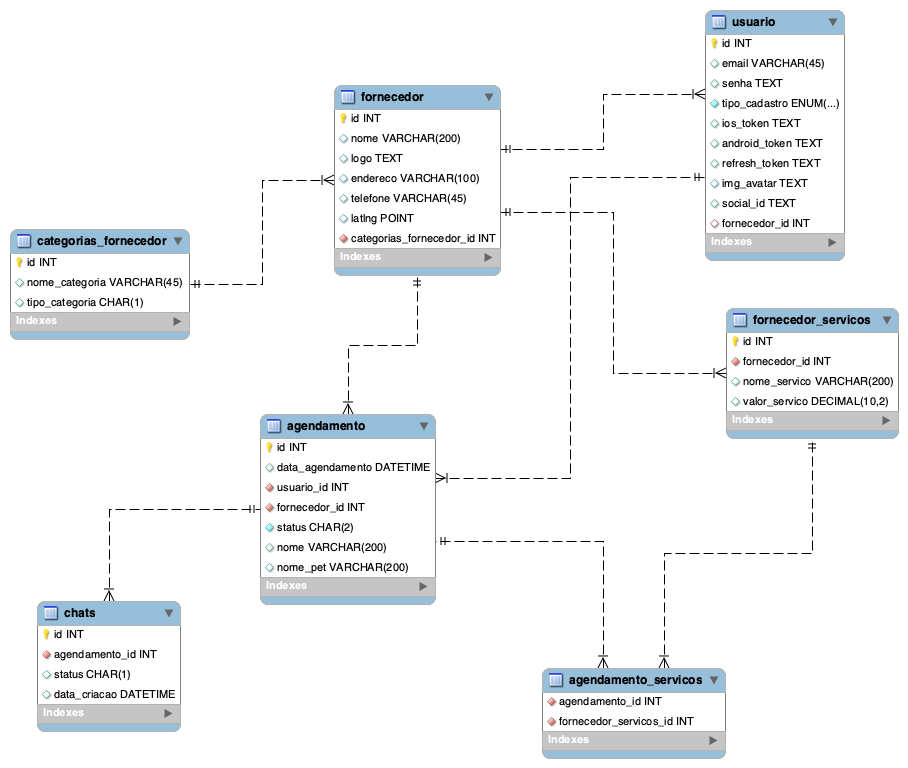

# Módulo usuário

## Modelagem de dados



## Registrar usuário

- Rode o script_database.sql

## Login social

## Postman atualizar variável dinamicamente

na aba de tests, crie um script

```js
var jsonData = pm.response.jsopn();
pm.globals.set('access_token', jsonData.access_token);
```

use como `{{access_token}}`

## Refresh Token

ViewModel: Dados que são enviados entre as camadas.

InputModel: Envida dados de input para nosso serviço

## Recuperar usuário logado

## Atualizar url avatar

## Atualização do Device Token (Para Push Notification)

