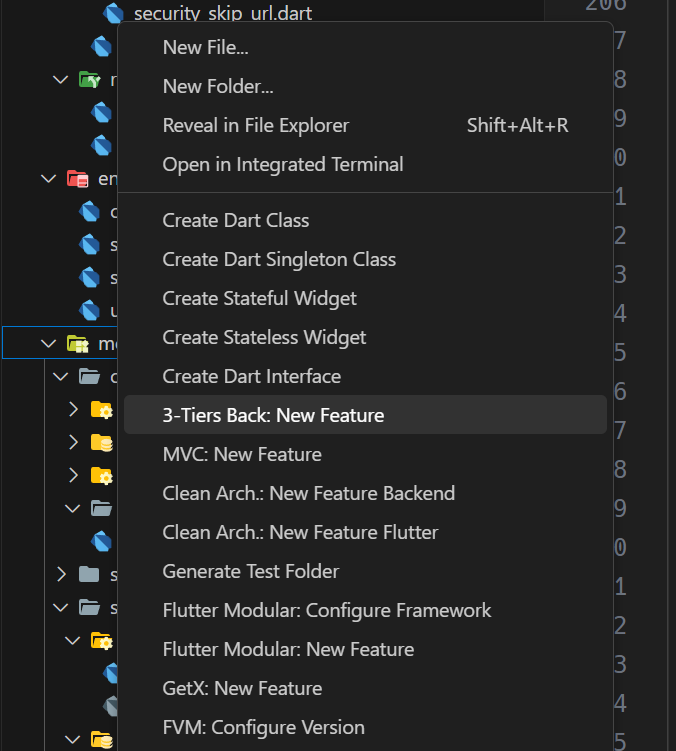

# Módulo de Agendamento

## Criando módulo

## Agendando serviço em um fornecedor

## Alterando status do agendamento

## Buscar todos agendamentos pelo usuário logado

## Buscar todos agendamentos pelo usuário de fornecedor logado
