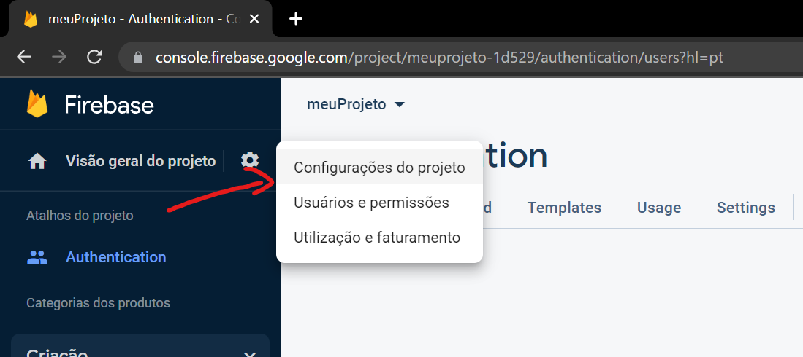
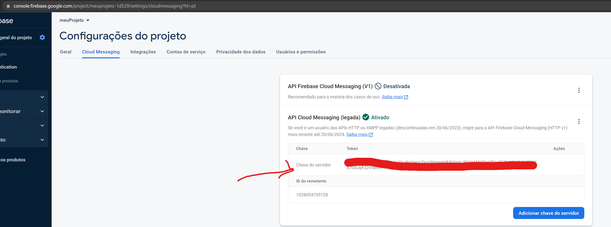

# Módulo de Chat

## Criando módulo

## Iniciando um chat

## Push notification - Criando estrutura

## Push notification - Enviando Notificação




Vamos utilizar o padrão facades para implementar o push_notification

```bash
dart pub add http
```

```bash
curl --request POST \
  --url https://fcm.googleapis.com/v1/projects/1028054755728/messages:send \
  --header 'Authorization: Bearer <token>' \
  --header 'Content-Type: application/json' \
  --data '{
    "message": {
      "topic": "<topic>",
      "notification": {
        "title": "Breaking News",
        "body": "New news story available."
      },
      "priority": "high",
      "data": {
        "click_action": "FLUTTER_NOTIFICATION_CLICK",
        "id": "1",
        "status": "done",
        "payload": {
        }
      }
    }
  }'
```

## Buscando chats ativos do usuário

## Buscando chats ativos do fornecedor

## Finalizando um Chat

