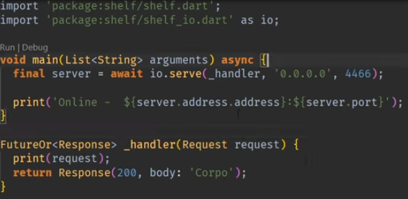
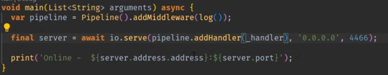
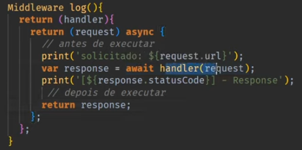
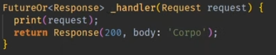
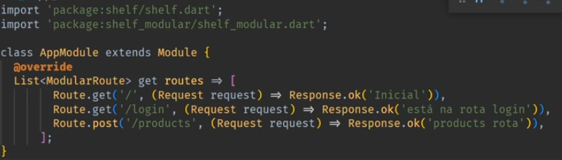
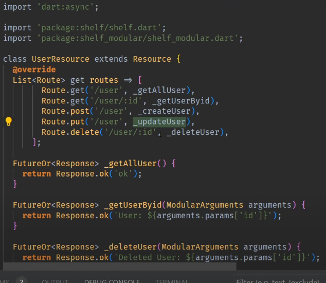
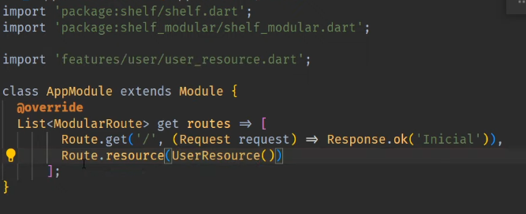

# Dart backend (Semana do backend)

## 1 - Roadmap para Dart no backend

[Roadmap](https://www.notion.so/danielmorita/Roadmap-63f983fdfdf44a808535a5192a24746c?pvs=4)

## 2 - Criando projeto Dart para backend da forma correta

```bash
dart create backend
```

## 3 - primeiro contato com o Shelf



## 4 - Middleware explicado





## 5 - Rotas com shelf_modular

no lugar do shelf_router vamos utilizar o shelf_modular



## 6 - Seu código sempre organizado com o Resource




## 7 - Técnica DotEnv(.env)

## 8 - Modelando tabelas com Prisma

[Prisma](https://www.prisma.io/)

## 9 - O conector do Postgres

## 10 - CRUD completo

## 11 - Documentação de API com Swagger

[shelf_swagger_ui](https://pub.dev/packages/shelf_swagger_ui)

[Swaagger Viewer - plugin vs](https://marketplace.visualstudio.com/items?itemName=Arjun.swagger-viewer)

- specs\swagger.yaml
- lib\src\features\swagger\swagger_handler.dart

## 12 - Mais sobre Middleware

- lib\backend.dart
  - jsonResponse()

## 13 - Salvando senha na base de dados do jeito certo

Gerador de chaves
[bcrypt](https://pub.dev/packages/bcrypt)

- lib\src\core\services\bcrypt\bcrypt_service_impl.dart

## 14 - O tão esperado Resource de Auth

## 15 - Criando e entendendo o JWT

[dart_jsonwebtoken](https://pub.dev/packages/dart_jsonwebtoken)

## 16 - Extractor de Basic e Bearer entao toma

## 17 - Login com JWT

## 18 - Que tal um pouco de proteção de rotas

## 19 - Atualizando o token

## 20 - Atualizando a senha do usuário

## 21 - Aplicando padrões de projeto

## 22 - Componentizando Swagger

## 23 - Publicando backend em Dart
